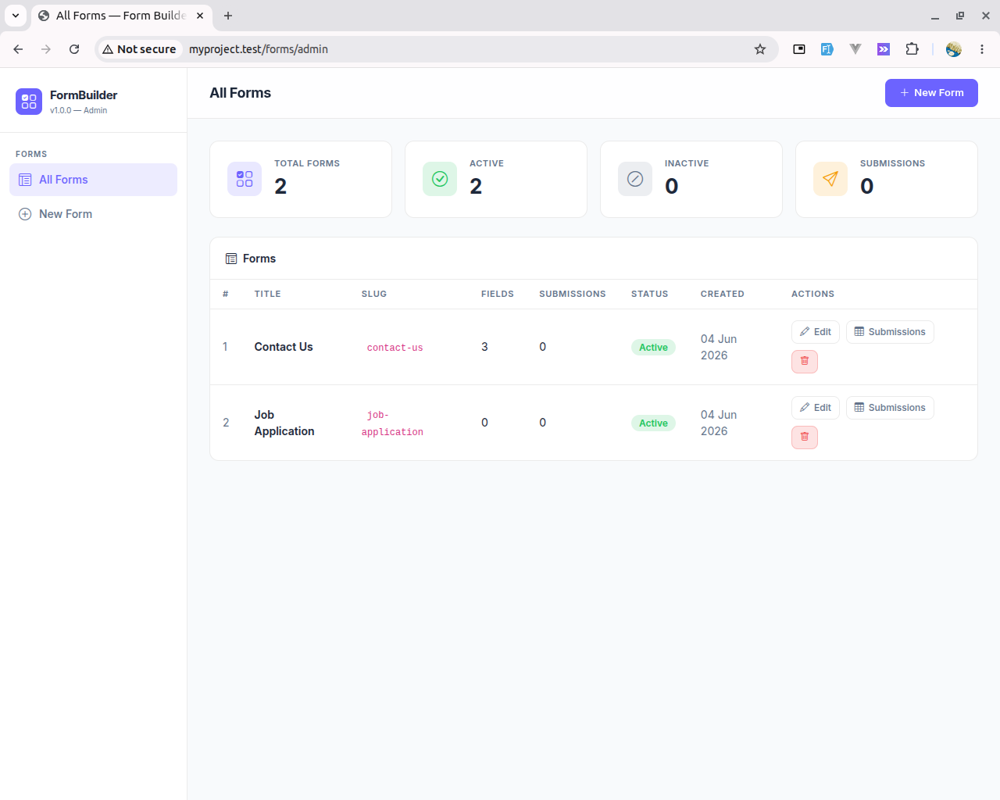
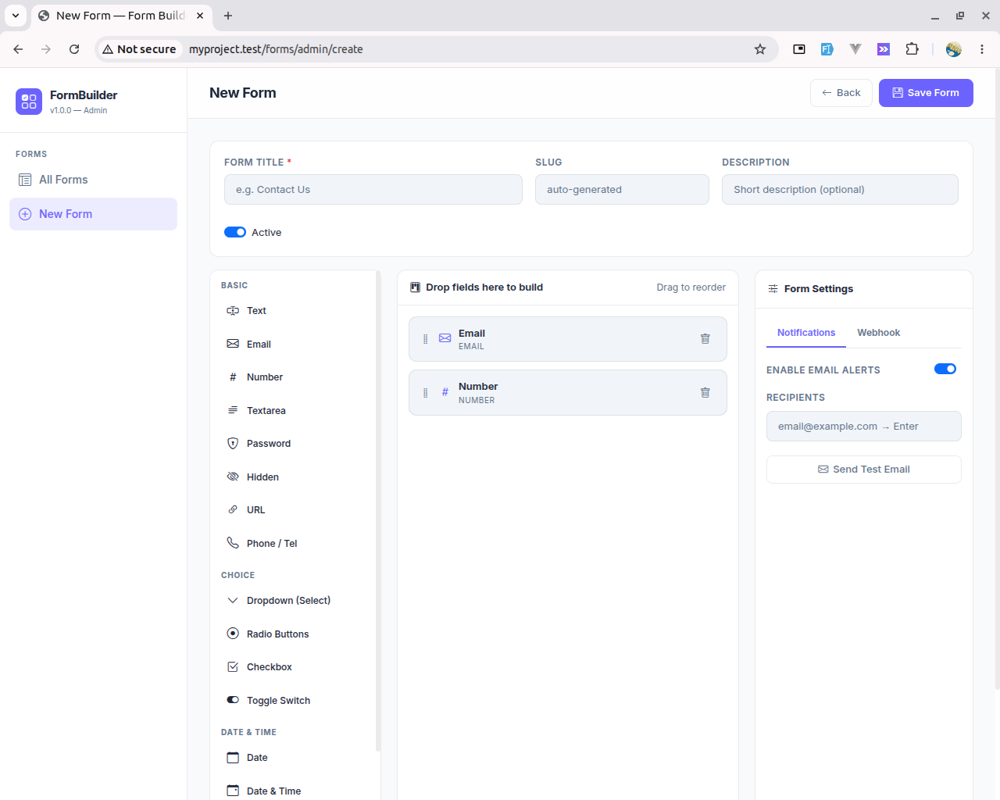

# Laravel Form Builder

<p align="center">
  
  
  
  
</p>

> A dynamic, database-driven form builder for Laravel. Inspired by Typeform, Google Forms, and WPForms — built for developers.

---


## Features

| Feature | Status |
|---|---|
| 21 field types (text → repeater) | ✅ |
| Drag-and-drop admin UI | ✅ |
| Database-driven form definitions | ✅ |
| Dynamic validation (per-field rules) | ✅ |
| Conditional field logic (show/hide) | ✅ |
| File & image upload support | ✅ |
| Repeater fields (nested rows) | ✅ |
| Form submissions with export (CSV/Excel/PDF) | ✅ |
| Email notifications on submission | ✅ |
| Webhook support | ✅ |
| API endpoints (JSON) | ✅ |
| Embeddable `<iframe>` mode | ✅ |
| Blade directive `@form('slug')` | ✅ |
| Caching layer | ✅ |
| PSR-4, Laravel package conventions | ✅ |

---

## Requirements

- PHP `^8.1`
- Laravel `^10.0 | ^11.0`

---

## Installation

```bash
composer require hyderkamran/laravel-form-builder
```

The service provider and `FormBuilder` facade are auto-discovered by Laravel.

### Publish & Migrate

```bash
# Config
php artisan vendor:publish --tag=form-builder-config

# Migrations
php artisan vendor:publish --tag=form-builder-migrations
php artisan migrate

# Frontend assets (JS for drag-and-drop + conditional logic)
php artisan vendor:publish --tag=form-builder-assets

# (Optional) Views — only if you need to customise Blade templates
php artisan vendor:publish --tag=form-builder-views

# (Optional) Demo seeders
php artisan vendor:publish --tag=form-builder-seeders
php artisan db:seed --class=FormBuilderSeeder
```

---

## Configuration

`config/form-builder.php`:

```php
return [
    'storage_disk'             => 'public',        // disk for file uploads
    'export_format'            => ['csv', 'xlsx', 'pdf'],
    'enable_notifications'     => true,
    'notification_recipients'  => [],              // fallback emails
    'admin_middleware'         => ['web'],          // add 'auth' to protect
    'cache_ttl'                => 3600,            // seconds; 0 = disabled
    'upload' => [
        'max_size_kb'   => 10240,
        'allowed_mimes' => ['jpeg', 'png', 'pdf', 'docx', ...],
    ],
];
```

You can also use `.env` variables:

```env
FORM_BUILDER_DISK=public
FORM_BUILDER_NOTIFICATIONS=true
FORM_BUILDER_RECIPIENTS=admin@example.com,support@example.com
FORM_BUILDER_CACHE_TTL=3600
```

---

## Usage

### Creating a Form (Programmatic)

```php
use Hyderkamran\FormBuilder\Models\Form;
use Hyderkamran\FormBuilder\Models\FormField;
use Hyderkamran\FormBuilder\Enums\FieldType;

$form = Form::create([
    'title'       => 'Contact Us',
    'slug'        => 'contact-us',
    'description' => 'We would love to hear from you.',
    'is_active'   => true,
]);

FormField::create([
    'form_id'          => $form->id,
    'label'            => 'Full Name',
    'name'             => 'name',
    'type'             => FieldType::Text->value,
    'is_required'      => true,
    'order'            => 0,
]);

FormField::create([
    'form_id'          => $form->id,
    'label'            => 'Email',
    'name'             => 'email',
    'type'             => FieldType::Email->value,
    'is_required'      => true,
    'order'            => 1,
    'validation_rules' => ['email' => 'rfc'],
]);

FormField::create([
    'form_id'     => $form->id,
    'label'       => 'Country',
    'name'        => 'country',
    'type'        => FieldType::Select->value,
    'is_required' => true,
    'order'       => 2,
    'options'     => [
        'choices' => ['pk' => 'Pakistan', 'us' => 'United States', 'uk' => 'United Kingdom'],
    ],
]);
```

### Rendering in Blade

```blade
{{-- Blade directive --}}
@form('contact-us')

{{-- Or via Facade --}}
{!! FormBuilder::render('contact-us') !!}
```

### Embedding via `<iframe>`

```html
<iframe src="{{ url('/forms/contact-us/embed') }}" width="100%" height="600" frameborder="0"></iframe>
```

---

## Field Types

| Group | Types |
|---|---|
| **Basic** | `text`, `email`, `number`, `textarea`, `password`, `hidden`, `url`, `tel` |
| **Choice** | `select`, `radio`, `checkbox`, `toggle` |
| **Date & Time** | `date`, `datetime`, `time` |
| **Media** | `file`, `image` |
| **Special** | `range`, `color`, `rating` |
| **Pro** | `repeater` |

Access via enum:

```php
use Hyderkamran\FormBuilder\Enums\FieldType;

FieldType::Rating->label();   // "Star Rating"
FieldType::Rating->icon();    // "bi-star"
FieldType::Rating->group();   // "Special"
FieldType::grouped();         // ['Basic' => [...], 'Choice' => [...], ...]
```

---

## Conditional Logic

Show or hide a field based on another field's value. Set via `options['logic']`:

```php
FormField::create([
    // ... other attributes
    'options' => [
        'logic' => [
            'field'    => 'country',   // watch this field
            'operator' => '=',         // =, !=, >, <
            'value'    => 'pk',        // match this value
            'action'   => 'show',      // 'show' or 'hide'
        ],
    ],
]);
```

This is also configurable in the drag-and-drop admin UI under the **Logic** tab.

---

## Repeater Fields

A repeater allows nested, dynamic row-based data:

```php
FormField::create([
    'form_id' => $form->id,
    'label'   => 'Work Experience',
    'name'    => 'experience',
    'type'    => FieldType::Repeater->value,
    'options' => [
        'fields' => [
            ['name' => 'company', 'label' => 'Company', 'type' => 'text',   'required' => true, 'width' => 6],
            ['name' => 'role',    'label' => 'Role',    'type' => 'text',   'required' => true, 'width' => 6],
            ['name' => 'years',   'label' => 'Years',   'type' => 'number', 'required' => false, 'width' => 12],
        ],
    ],
]);
```

---

## Exporting Submissions

```php
use Hyderkamran\FormBuilder\Services\FormExporter;

// By slug or ID:
FormExporter::toCSV('contact-us');
FormExporter::toExcel('contact-us');
FormExporter::toPdf('contact-us');
```

Or hit the admin export routes directly:

```
GET /forms/admin/{id}/export/csv
GET /forms/admin/{id}/export/xlsx
GET /forms/admin/{id}/export/pdf
```

---

## API Endpoints

```
GET  /api/form-builder/forms/{slug}        → Form schema (JSON)
POST /api/form-builder/forms/{slug}/submit → Submit (JSON)
```

### Submit example (cURL):

```bash
curl -X POST https://your-app.com/api/form-builder/forms/contact-us/submit \
  -H "Accept: application/json" \
  -H "Content-Type: application/json" \
  -d '{"name": "Alice", "email": "alice@example.com"}'
```

---

## Notifications & Webhooks

Configure per-form in the admin panel **Settings** tab or via `Form::settings`:

```php
$form->update([
    'settings' => [
        'enable_notifications'     => true,
        'notification_recipients'  => ['admin@example.com'],
        'webhook_enabled'          => true,
        'webhook_url'              => 'https://hooks.example.com/form',
    ]
]);
```

---

## HasForms Trait

```php
use Hyderkamran\FormBuilder\Traits\HasForms;

class Contact extends Model
{
    use HasForms;
}

// Attach a form to any model via polymorphic relation:
$contact->forms()->attach($form->id);
```

---

## Admin UI

Visit `/forms/admin` in your browser.

| Page | URL |
|---|---|
| Dashboard | `/forms/admin` |
| Create Form | `/forms/admin/create` |
| Edit Form | `/forms/admin/{id}/edit` |
| Submissions | `/forms/admin/{id}/submissions` |

> To protect the admin with auth, set `admin_middleware` → `['web', 'auth']` in your config.

---

## Testing

```bash
vendor/bin/phpunit
```

The test suite covers:
- Form & field model creation
- Submission validation (required, email, custom rules)
- File upload handling
- Form rendering output
- CSV export response headers
- Admin CRUD endpoints
- FieldType enum

---

## Package Structure

```
laravel-form-builder/
├── config/form-builder.php
├── database/
│   ├── migrations/
│   └── seeders/FormBuilderSeeder.php
├── resources/
│   ├── views/
│   │   ├── admin/          ← Admin UI (layout, index, form_edit, submissions)
│   │   ├── fields/         ← 21 field blade templates
│   │   ├── emails/         ← Email notification template
│   │   ├── exports/        ← PDF export template
│   │   ├── form.blade.php
│   │   └── form-embed.blade.php
│   └── js/
│       ├── admin.js        ← Drag-and-drop builder engine
│       └── form-builder.js ← Conditional logic + repeater JS
├── routes/
│   ├── web.php
│   └── api.php
├── src/
│   ├── Enums/FieldType.php
│   ├── Events/
│   ├── Facades/FormBuilder.php
│   ├── Http/Controllers/
│   ├── Mail/
│   ├── Models/
│   ├── Services/
│   ├── Traits/HasForms.php
│   ├── FormBuilder.php
│   └── FormBuilderServiceProvider.php
└── tests/Feature/FormBuilderTest.php
```

---

## Contributing

Pull requests are welcome. Please open an issue first to discuss what you would like to change.

---

## License

MIT License — see [LICENSE](LICENSE) for details.

---

<p align="center">Built for the Laravel community.</p>
